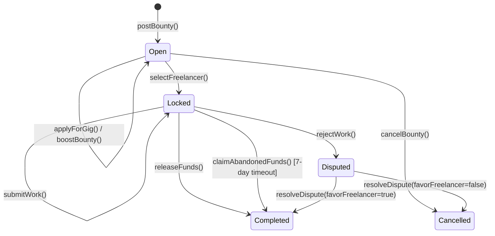
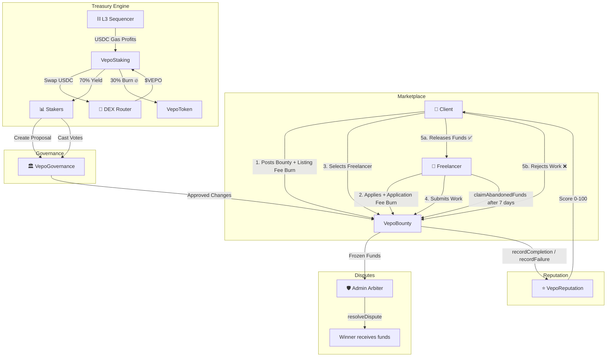
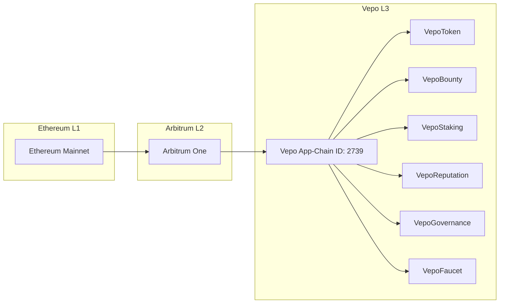

# Vepo Network Architecture (V4.0)

> Technical System Design for the Vepo L3 App-Chain Freelance Protocol

---

## 1. Why an Arbitrum L3 App-Chain?

Vepo Network is deployed as a dedicated **Arbitrum Orbit L3 App-Chain** rather than a standard L2 smart contract deployment. This architectural decision provides critical advantages for a micro-bounty marketplace:

| Challenge | L2 Deployment | L3 App-Chain (Vepo) |
|---|---|---|
| **Gas Costs** | Shared with all L2 apps; variable | Dedicated blockspace; predictable & ultra-low |
| **Throughput** | Competing for blockspace | Dedicated sequencer; guaranteed throughput |
| **Revenue Capture** | Gas fees go to L2 sequencer | Gas fees route to Vepo Treasury → staker yields |
| **Customization** | Limited to EVM defaults | Custom gas token (USDC), tuned block times |
| **Spam Resistance** | Relies on gas alone | L3 gas + $VEPO Quadruple Burn fees |

### Data Availability: AnyTrust

Vepo L3 uses Arbitrum's **AnyTrust** data availability model, which provides:
- **Cost Efficiency:** Transaction data is stored by a Data Availability Committee (DAC) instead of Ethereum L1 calldata, reducing costs by 10–100×.
- **Security Guarantee:** A 2-of-N honest assumption — if at least 2 DAC members are honest, data availability is guaranteed.
- **Ideal for Micro-Transactions:** The low-value, high-frequency nature of bounty operations benefits from AnyTrust's cost model.

---

## 2. Smart Contract Ecosystem

### 2.1 Contract Overview

| Contract | Purpose | Key Capabilities |
|---|---|---|
| **VepoToken.sol** | ERC-20 utility token | Fixed 100M supply, `burn()`, `burnFrom()` |
| **VepoBounty.sol** | Escrow & marketplace engine | Post/boost/apply/cancel bounties, dispute arbitration, time-locks |
| **VepoStaking.sol** | Treasury & yield engine | USDC→VEPO buyback, 70/30 staker/burn split, floor clamping |
| **VepoFaucet.sol** | Testnet token distribution | Rate-limited drips, configurable amounts |
| **VepoReputation.sol** | On-chain reputation scoring | Job tracking, score computation, authorized updates |
| **VepoGovernance.sol** | DAO voting module | Proposal creation, weighted voting, quorum enforcement |
| **MockUSDC.sol** | Test stablecoin | Local development only |
| **MockUniswapV2Router.sol** | Test DEX router | Fixed-rate swaps for local testing |

### 2.2 Inheritance & Security Patterns

```
VepoToken
├── ERC20 (OpenZeppelin)
├── ERC20Burnable (OpenZeppelin)
└── Ownable (OpenZeppelin)

VepoBounty
├── ReentrancyGuard (OpenZeppelin)
├── Ownable (OpenZeppelin)
└── Pausable (OpenZeppelin)

VepoStaking
├── ReentrancyGuard (OpenZeppelin)
├── Ownable (OpenZeppelin)
└── Pausable (OpenZeppelin)

VepoReputation
└── Ownable (OpenZeppelin)

VepoGovernance
└── Ownable (OpenZeppelin)
```

---

## 3. Core Data Flows

### 3.1 Bounty Lifecycle (State Machine)



### 3.2 Full Protocol Data Flow



---

## 4. Contract Interaction Matrix

Shows which contracts call which:

| Caller → Target | VepoToken | VepoBounty | VepoStaking | VepoReputation | VepoGovernance |
|---|---|---|---|---|---|
| **VepoBounty** | `burnFrom()` | — | — | `recordCompletion()` | — |
| **VepoStaking** | `burn()`, `transfer()` | — | — | — | — |
| **VepoFaucet** | `transfer()` | — | — | — | — |
| **VepoGovernance** | `balanceOf()` | — | — | — | — |
| **Users** | `approve()`, `transfer()` | All public functions | `stake()`, `withdraw()`, `claimYield()` | Read-only views | `createProposal()`, `castVote()` |
| **Owner** | — | `setFees()`, `resolveDispute()`, `pause()` | `processSequencerProfits()`, `updateBurnBps()` | `setBountyContract()` | `executeProposal()`, `updateGovernanceParams()` |

---

## 5. Security Architecture

### 5.1 Access Control Model

| Role | Permissions | Contract |
|---|---|---|
| **Owner (Admin)** | Fee adjustment, dispute resolution, pause/unpause, profit processing | VepoBounty, VepoStaking |
| **Bounty Client** | Post, boost, cancel bounties; select freelancer; release/reject work | VepoBounty |
| **Freelancer** | Apply for gigs, submit work, claim abandoned funds | VepoBounty |
| **Staker** | Stake/withdraw $VEPO, claim yields, create/vote on proposals | VepoStaking, VepoGovernance |
| **Authorized Contract** | Record reputation events | VepoReputation |

### 5.2 Security Mechanisms

| Mechanism | Implementation | Protection Against |
|---|---|---|
| **ReentrancyGuard** | `nonReentrant` on all fund transfers | Reentrancy attacks |
| **Pausable** | Emergency circuit-breaker on VepoBounty + VepoStaking | Exploit containment |
| **Supply Floor Clamping** | Math ensures `totalSupply >= supplyFloor` | Accidental supply depletion |
| **7-Day Time-Lock** | `claimAbandonedFunds()` requires 7-day wait | Client ghosting |
| **Process Cooldown** | `processInterval` between sequencer profit calls | MEV/griefing |
| **Safe Reward Math** | Rounding-safe subtraction in `_settlePendingReward()` | Arithmetic underflow |

### 5.3 Upgrade Path

The current architecture uses **immutable contracts** — no proxy pattern. This is intentional for V1:
- Simpler security model (no proxy storage collision risks).
- Easier to audit for grant reviewers.
- Future versions may introduce UUPS proxies if protocol-level upgrades become necessary.

---

## 6. Technology Stack

| Layer | Technology | Purpose |
|---|---|---|
| **L1 Settlement** | Ethereum Mainnet | Final security and data anchoring |
| **L2 Bridge** | Arbitrum One | Rollup bridge for L3 |
| **L3 Execution** | Arbitrum Orbit (AnyTrust DA) | Dedicated app-chain with custom gas token |
| **Smart Contracts** | Solidity ^0.8.20 | Core protocol logic |
| **Contract Framework** | Hardhat + OpenZeppelin 5.x | Compilation, testing, deployment |
| **Frontend** | Vue 3 + Vite + TypeScript | Web3 dApp interface |
| **Web3 Integration** | Wagmi + Viem | Wallet connection, contract reads/writes |
| **Styling** | TailwindCSS + Custom Glassmorphism | Dark-mode premium UI |

---

## 7. Deployment Architecture



**Chain Configuration:**
- **Chain ID:** 2739
- **Gas Token:** USDC (native)
- **Data Availability:** AnyTrust (DAC-backed)
- **Block Time:** Configurable (targeting sub-second finality)
